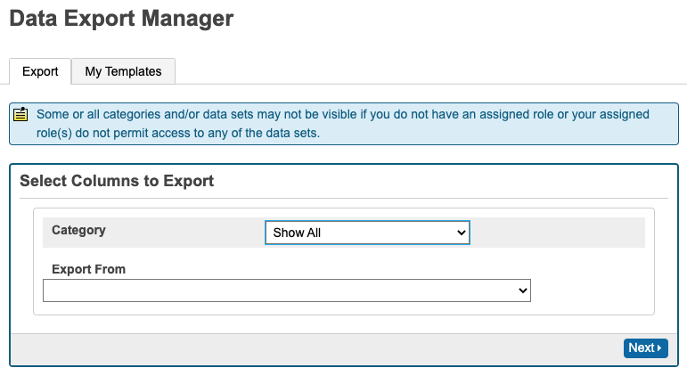
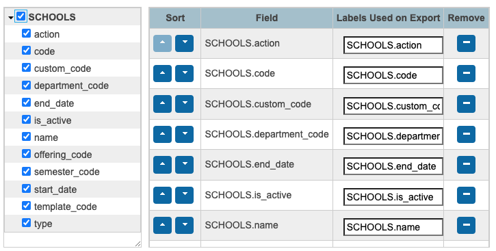
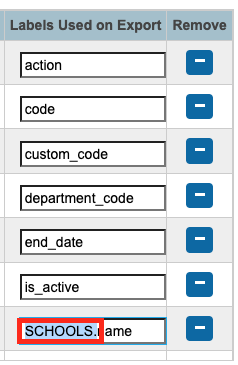

<!-- omit in toc -->
# D2L BrightSpace IPSIS exports from PowerSchool SIS

Feb-June 2022 : Aaron Ciuffo : aciuffo@ash.nl : aaron.ciuffo@gmail.com
- [Implementation Notes](#implementation-notes)
- [Setup and Installation](#setup-and-installation)
  - [SIS Installation](#sis-installation)
  - [Data Export Manager Configuration](#data-export-manager-configuration)
- [Automated Exports from PSL to BrightSpace](#automated-exports-from-psl-to-brightspace)
  - [In Progress Notes](#in-progress-notes)
- [List of Plugins and Functions](#list-of-plugins-and-functions)
- [Plugin Documentation](#plugin-documentation)
  - [Updating a Plugin](#updating-a-plugin)
- [Reference Documentation](#reference-documentation)
  - [Basic PowerQuery Plugin Structure](#basic-powerquery-plugin-structure)
- [IPSIS Import Errors and Solutions](#ipsis-import-errors-and-solutions)


### Course Offerings

**ERROR:** *Course Offerings.Parent org unit mapping not found*

EXAMPLE IPSIS ERROR:
| | |
|-|-|
|IPSIS Field|Data|
|ParentSourcedId|Templ_3_|
|RecordType|CourseOffering|
|Operation|Replace|
|SourcedId|co_3_FHA1IBSSSS2|

**Suggested Resolution:**  PowerSchool SIS `COURSES.SCHED_DEPARTMENT` field is empty; add a department. Search in `Start Page > School Setup > Courses` for the Course Number to verify the issue. The course number is the last portion of the `SourceID` generated by IPSIS: `co_3_`[**`FHA1IBSSSS2`**].

### Users

**ERROR:** *User(s) could not be processed.ParentPortalDeleteRelationshipHandler - Unable to find user mapping, parents not updated*

EXAMPLE IPSIS ERROR:
| | |
|-|-|
|SourcedId|P_577106|

**Suggested Resolution:** This is likely due to a parent that does not exist and is being deactivated or deleted. The parent can be identified by the ID number. This can likely be ignored.

**ERROR:** *User(s) could not be processed.No user mapping found for source system*

EXAMPLE IPSIS ERROR:
| | |
|-|-|
|SourceSystem|3|
|IMIdentifier|P_577106|
|RecordType|User|
|Operation|Delete|
|SourcedId|P_577106|

**Suggested Resolution:** This is likely due to a parent that does not exist and is being deactivated or deleted. The parent can be identified by the ID number. Check the `SourceID` if this matches the previous error, this can likely be ignored.

## Implementation Notes

Exports are managed through PowerSchool PowerQuery Plugins. Plugins follow the structure outlined below. Each CSV Export for BrightSpace is managed through an individual plugin. Each plugin contains an SQL query that matches the required fields for the CSV.

## Setup and Installation

### SIS Installation

1. Download plugins from this GIT Repo; each plugin is stored as a .zip file
   - See [list below](#list-of-plugins-and-functions) for all plugins and their fuctions
2. Install plugins throught the _Plugin Management Dashboard_: 
   - **Start Page > System Administrator > System Settings > Plugin Management Dashboard**
   - If the plugin is already installed either choose to _Update_ or _Delete_ and reinstall using the .zip files
3. Configure a template for automated export in [_Data Export Manager_](#data-export-manager-configuration)
   - **Start Page > System Administrator > Page and Data Management > Data Export Manager**

### Data Export Manager Configuration

**Start Page > System Administrator > Page and Data Management > Data Export Manager**

Each plugin needs to be configured to produce CSV files with the appropriate data, characterset and column headers. Each plugin documents the structure and settings under the **Data Export Manager Setup** heading. See the `README.md` in each plugin directory for more details.

The basic settings are as follows:

1. Select Columns to Export:
   - **Category:** _Show All_
   - **Export From:** _NQ com.txoof.brightspace.table.area_ (see the DEM section in each readme)
   - 
2. Select all of the fields:
   - 
3.  Remove the `TABLE.` portion in the _Labels used on Export_ for every column (highlighted in blue/red) and click _Next_
   - 
4. On the following _Select/Edit Records from NQ - com.txoof.brightspace.table.area_ screen click _Next_
    - No filtering should be needed
5. On the following _Export Summary and Output Options_ screen set:
   - **Export File Name**: _See README.md_ for filename format (e.g. `1-Other.csv`)
   - **Line Delimiter**: `CR-LF`
   - **Field Delimiter**: `Comma`
   - **Character Set**: `UTF-8`
6. Click _Save Template_; see the `README.md` for each plugin for specifics
   - **Name**: `1-Other-%d.csv Export`
   - **Description**: `Updated: YYYY.MM.DD`
7. Click _Save as New_

## Automated Exports from PSL to BrightSpace

### In Progress Notes

BrightSpace accepts imports via IPSIS. IPSIS expects flat zip files with at minimum 8 CSV files (1-Other, 2-Departments, 3-Semesters, 4-Templates, 5-Offerings, 6-Sections, 7-Users, 8-Enrollments) and a `manifest.json`. 

`manifest.json`

```JSON
{
  "version":"2.0"
}
```

Files are sent to IPSIS via SFTP. Find SFTP details within the platform [here](https://lms.ash.nl/d2l/im/ipsis/admin/console/integration/3/dashboard)


## List of Plugins and Functions

- [BS_Organization](./BS_Organization/README_Organization.md): Export BrightSpace CSVs 1-6
  - 1: Other; 2: Departments; 3: Semesters; 4: Templates, 5: Offerings; 6: Sections
- [BS_Users-Enrollments](./BS_Users_Enrollments/README_Users_Enrollments.md): Export BrightSpace CSVs 7-8
  - 7: Users, 8: Enrollments

## Plugin Documentation

### Updating a Plugin

The Named Queries (NQ) within each plugin can be updated by editing the associated `xxx.named_query.xml` file. No changes to the files in the `permissions_root` should be necessary unless a new NQ is added. See the [Basic PowerQuery Plugin Structure](#basic-powerquery-plugin-structure) section below for more information.

After updating the NQ, it is necessary to update the version number in the `plugin.xml` file. PowerSchool will complain during the upgrade process if the version number remains the same or regresses. Always increment the version number.

PowerSchool SIS is very particular about the package structure of the plugin zip file. Use the `./package` script included in this repository to repackage the script. The package script will generate a new plugin with the current version number and the current time specified in the zip filename. 

Usage: `package.sh PLUGIN_DIR`

Example:
```SHELL
$ ./package.sh BS_Organization
```

## Reference Documentation

- [BrightSpace CSV v2.0](https://community.brightspace.com/s/article/D2L-Standard-CSV-Version-2-0-Administrator-Guide)
- [Plugins](https://support.powerschool.com/developer/#/page/plugins)
- [Plugin XML](https://support.powerschool.com/developer/#/page/plugin-xml)
- [Plugin Setup](https://support.powerschool.com/developer/#/page/plugin-zip)
- [Permission Mapping](https://support.powerschool.com/developer/#/page/permission-mapping)
- [PowerQueries](https://support.powerschool.com/developer/#/page/powerqueries)

### Basic PowerQuery Plugin Structure

Plugins must be zipped such that the `plugin.xml` file is at the root of the structure with no top level folder. Multiple Named Queries (NQ) can be specified within one plugin. Each NQ needs to be placed in the `queries_root` directory with an associated `permission_mappings.xml` placed in the `permissions_root` directory.

The `MessageKeys` and `web_root` directories are not used in these plugins and can be ignored.

```TEXT
|
+-- plugin.xml
|
+-- queries_root
    |
    *-- partner.module1.named_queries.xml
    *-- partner.module2.named_queries.xml
+-- permissions_root
    |
    *-- partner.module1.permission_mappings.xml
    *-- partner.module2.permission_mappings.xml
+-- MessageKeys
    |
    *-- example-plugin-message-keys.US_en.properties
+-- web_root
    |
    *-- admin
        |
        *-- home.partner.content.footer.txt
```


Sets access permissions for this query plugin. See this [blog post](https://cookbrianj.wordpress.com/2017/01/23/plugin-export-with-ps-dem/).

```XML
<permission_mappings>
    <!--Anyone that has access to the following page can run this query-->
    <permission name='/admin/home.html'>
        <!--.../query/BASE_PLUGIN should be identical to `name` in named_queries.xml-->
        <implies allow="post">/ws/schema/query/BASE_PLUGIN</implies>
    </permission>
</permission_mappings>
```

## IPSIS Import Errors and Solutions